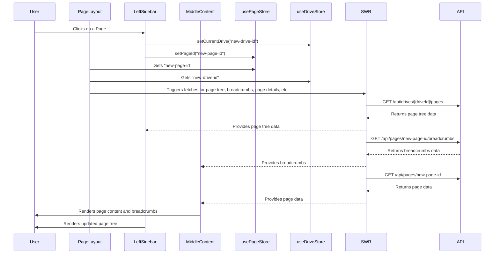

# Page State Management Architecture

**Last Updated:** 2025-07-13

This document provides a definitive guide to the page state management system in this application. It is designed to be the single source of truth for understanding how page data is fetched, cached, and displayed throughout the UI.

## 1. Core Architectural Principle: Server-Side Truth, Client-Side Pointers

To ensure data consistency and leverage Next.js 15 features, our architecture is built on a **server-centric** model.

- **The Database is the Truth:** All page data, including the hierarchical structure, is fetched directly from the database via API routes as needed. There is no persistent, all-encompassing client-side cache of the entire page tree.
- **Zustand is a Pointer:** `usePageStore` (Zustand) is the primary client-side state management tool for the active page. `useDriveStore` (Zustand) manages the active drive. These act as global pointers, indicating which drive and page are currently active.
- **SWR for Caching:** SWR is used for server-state caching, handling data fetching, and managing cache invalidation for API requests like page details, breadcrumbs, and children.

This model simplifies client-side logic, reduces initial load times, and ensures that the UI always reflects the most up-to-date information from the server.

## 2. The Key Players: Hooks

Several hooks work in tandem to manage this system:

### `usePageStore` (Zustand Store)

This is a simple Zustand store that holds the most critical context.

- **Location:** `apps/web/src/hooks/usePage.ts`
- **Responsibilities:**
    - To hold the `pageId` of the page the user is currently viewing.
- **Exposed State:**
    - `pageId: string | null`: The ID of the active page.
    - `setPageId(pageId: string | null)`: The function to update the active page ID.

### `useDriveStore` (Zustand Store)

This is a simple Zustand store that holds the critical drive context.

- **Location:** `apps/web/src/hooks/useDrive.ts`
- **Responsibilities:**
    - To hold the `driveId` of the drive the user is currently viewing.
    - To manage the list of available drives.
- **Exposed State:**
    - `currentDriveId: string | null`: The ID of the active drive.
    - `drives: Drive[]`: Array of all drives the user has access to.
    - `setCurrentDrive(driveId: string | null)`: The function to update the active drive ID.
    - `fetchDrives()`: Function to fetch all drives.

### `usePageTree`

This hook manages the state and interactions for the page navigation tree in the left sidebar.

- **Location:** `apps/web/src/hooks/usePageTree.ts`
- **Primary Data Source:** Fetches initial root-level pages for a drive via `GET /api/drives/[driveId]/pages`.
- **Responsibilities:**
    - Manages the hierarchical display of pages.
    - Handles drag-and-drop functionality for reordering pages.
    - Provides functions for creating, renaming, and deleting pages, which optimistically update the UI and then trigger API calls.

### `useBreadcrumbs`

This hook is responsible for fetching and displaying the breadcrumb navigation for the currently active page.

- **Location:** `apps/web/src/hooks/useBreadcrumbs.ts`
- **Primary Data Source:** Fetches data from the `/api/pages/[pageId]/breadcrumbs` endpoint.
- **Responsibilities:**
    - Provides the `breadcrumbs` array to the UI.
    - Handles the loading state of the breadcrumbs fetch.

## 3. The Data Flow in Practice

This is how the components and hooks interact during typical user actions.

### Sequence Diagram

### Step-by-Step Breakdown

1.  **Initial Load:** When a user navigates to a URL like `/dashboard/[driveSlug]/[pageId]`, the root layout component extracts `driveId` and `pageId` from the URL parameters.
2.  **State Initialization:** The main layout component calls `setCurrentDrive` from `useDriveStore` and `setPageId` from `usePageStore` to set the global context.
3.  **Component Rendering & Data Fetching:**
    - The `LeftSidebar` component uses `usePageTree` to fetch and render the navigation tree for the current `currentDriveId`.
    - The `MiddleContent` component uses the `pageId` from the `usePageStore`.
    - Components within `MiddleContent`, such as `Breadcrumbs`, use hooks like `useBreadcrumbs` which in turn use SWR to fetch their specific data from the API (e.g., `GET /api/pages/[pageId]/breadcrumbs`).
    - The main content view fetches the full page object using a similar SWR-based hook.
4.  **Page Selection:**
    - A user clicks on a different page in the `LeftSidebar`.
    - The `onClick` handler navigates the user to the new URL.
    - The process repeats from step 1, ensuring all components re-render with the correct data for the new context.

This server-centric approach, augmented by client-side pointers and a robust caching layer, creates a performant and maintainable state management system that aligns with modern Next.js best practices.