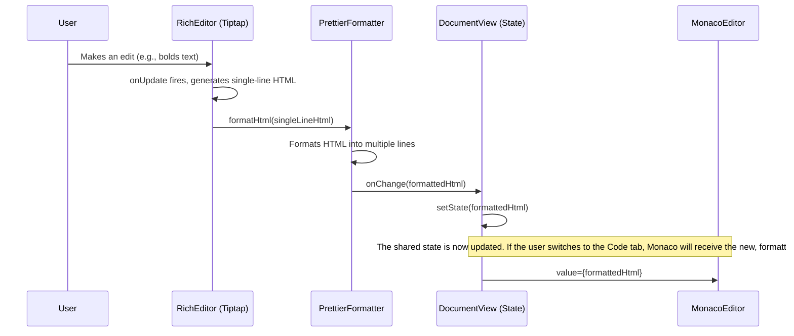
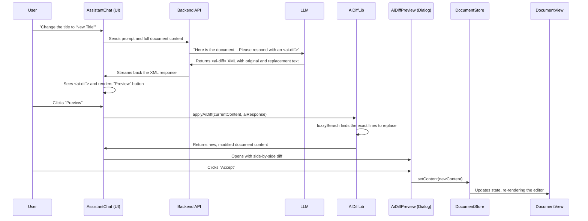

# 2.7 Editor Architecture

This document provides a comprehensive overview of the editor architecture in pagespace, detailing how the Tiptap (Rich Text), Monaco (Code), and Prettier components work together to provide a seamless and robust editing experience.

## High-Level Overview

The core of our editor system is the [`DocumentView.tsx`](apps/web/src/components/layout/middle-content/page-views/document/DocumentView.tsx:1) component. It acts as the parent controller for our two distinct editors and manages the shared state between them.

The user can switch between three tabs:

1.  **Rich:** A WYSIWYG editor powered by [Tiptap](2.5-integrations/tiptap.md).
2.  **Code:** A raw HTML editor powered by [Monaco Editor](2.5-integrations/monaco-editor.md).
3.  **View:** A sandboxed preview of the HTML content.

The most critical aspect of this architecture is how state is synchronized between the Tiptap and Monaco editors, which is made possible by our [Prettier integration](2.5-integrations/prettier.md).

## State Management: The `DocumentView` Component

The [`DocumentView`](apps/web/src/components/layout/middle-content/page-views/document/DocumentView.tsx:1) component holds the single source of truth for the page's content in its `value` state variable.

-   **Initialization:** When the component mounts, it initializes the `value` state with the page's content from the database.
-   **Props Drilling:** This `value` is passed down as a prop to both the `RichEditor` and the `MonacoEditor`.
-   **State Updates:** Both editors are controlled components. When a change is made in either editor, it calls the `setValue` function (via the `onChange` prop) to update the shared parent state.

## The Data Flow: Solving the Tiptap Problem

The primary challenge in this architecture is that Tiptap produces minified, single-line HTML, while Monaco is designed for multi-line code. A direct synchronization would lead to a poor user experience and break line-based diffing.

Our solution is to format Tiptap's output *before* it ever reaches the shared state.

Here is the end-to-end data flow when a user edits in the Rich Text view:

### Key Takeaways from the Data Flow:

1.  **Immediate Formatting:** The `onUpdate` handler in [`RichEditor.tsx`](apps/web/src/components/editors/RichEditor.tsx:1) is asynchronous. It immediately calls our [`formatHtml`](apps/web/src/lib/prettier.ts:4) utility.
2.  **State is Always Clean:** The `value` state in `DocumentView` is **never** populated with minified HTML. It only ever holds the pretty-printed version.
3.  **Unidirectional Flow from Tiptap's Perspective:** Tiptap outputs its HTML, which is then transformed. It is unaware of the formatting that happens after the fact.
4.  **Synchronization:** Because both editors read from and write to the same state variable in `DocumentView`, they are always synchronized. A change in one editor is immediately reflected in the other.

## Agentic Tooling: AI-Powered Line Replacement

This architecture is specifically designed to support advanced features like AI-powered editing and precise version control. The core of this functionality is a robust line replacement mechanism that allows an AI agent to reliably suggest and apply changes to the document.

### Core Components

-   **Backend API (`/api/ai/ai-assistant/messages`):** The brain of the operation. It receives the user's request and the full document context, then constructs a system prompt instructing the LLM to return edits in a specific `<ai-diff>` XML format.
-   **Diff Library (`/lib/ai-diff.ts`):** A client-side utility that parses the AI's XML response. Its most critical function, `fuzzySearch`, uses a Levenshtein distance algorithm to locate the *actual* position of the original text, making the system resilient to minor changes made by the user. The `applyAiDiff` function then uses this information to replace the content while preserving indentation.
-   **Assistant UI (`/components/layout/right-sidebar/ai-assistant/AssistantChat.tsx`):** This component orchestrates the frontend workflow. It sends the document context to the API, receives the AI-generated diff, and presents a "Preview & Apply Changes" button to the user.
-   **Preview Dialog (`/components/dialogs/AiDiffPreview.tsx`):** Utilizes the Monaco `DiffEditor` to display a clear, side-by-side comparison of the proposed changes, ensuring the user can review them safely before accepting.

### End-to-End Workflow

### Key Architectural Benefits

-   **Reliable Diffs:** Since the content is always stored as well-formatted, multi-line HTML, generating a `diff` produces meaningful, line-by-line changes.
-   **Resilient AI Edits:** The `fuzzySearch` mechanism ensures that AI suggestions can be applied even if the user has made minor edits to the document, preventing brittle, line-number-dependent operations.
-   **Human-in-the-Loop:** The preview dialog ensures that the user always has the final say, maintaining safety and control.
-   **Developer Experience:** The raw HTML stored in the database and viewed in the "Code" tab is human-readable, making debugging and manual intervention significantly easier.