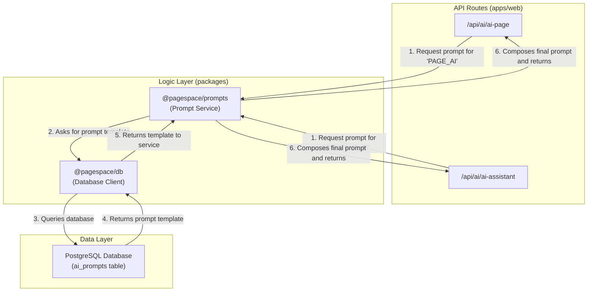

# System Prompts

## Overview

PageSpace uses a centralized system for managing AI system prompts to ensure maintainability, scalability, and security. All prompts are stored in the `ai_prompts` database table and accessed through the `@pagespace/prompts` package.

## Architecture

The prompt management system is composed of three main parts:

1.  **`ai_prompts` Table**: A dedicated table in the PostgreSQL database that stores prompt templates and their associated contexts.
2.  **`@pagespace/prompts` Package**: A centralized package that provides a unified interface for retrieving and composing prompts.
3.  **API Routes**: The AI-related API routes that use the `@pagespace/prompts` package to get the appropriate system prompt for a given context.



## `ai_prompts` Table

The `ai_prompts` table is defined in `packages/db/src/schema/ai.ts` and has the following schema:

| Column | Type | Description |
| :--- | :--- | :--- |
| `id` | `text` | Unique identifier for the prompt. |
| `name` | `text` | A human-readable name for the prompt (e.g., "Assistant Write - Document"). |
| `content` | `text` | The template for the system prompt. |
| `context` | `text` | The primary context (e.g., `PAGE_AI`, `ASSISTANT_AI`). |
| `subContext` | `text` | The secondary context (e.g., `WRITE`, `ASK`). |
| `pageType` | `text` | The type of page this prompt applies to (e.g., `DOCUMENT`, `VIBE`, `CHANNEL`). |
| `version` | `integer` | The version number of the prompt. |
| `isDefault` | `boolean` | Whether this is the default prompt for its context. |
| `createdBy` | `text` | The ID of the user who created the prompt (for future use). |

## `@pagespace/prompts` Package

The `@pagespace/prompts` package contains the logic for retrieving and composing system prompts. The primary function is `getSystemPrompt`, which takes a context object and returns the appropriate system prompt.

### `getSystemPrompt`

```typescript
import { getSystemPrompt } from '@pagespace/prompts';

const systemPrompt = await getSystemPrompt({
  context: 'ASSISTANT_AI',
  subContext: 'WRITE',
  pageType: 'DOCUMENT',
  pageTitle: 'My Document',
  pageContent: 'This is the content of my document.',
});
```

The `getSystemPrompt` function will query the `ai_prompts` table to find the best match for the given context. It will then replace any placeholders in the prompt template with the provided content.

### Security

To prevent prompt injection, all content placeholders are sanitized before being inserted into the prompt template. The sanitization function removes any potentially malicious characters or sequences from the user-provided content.